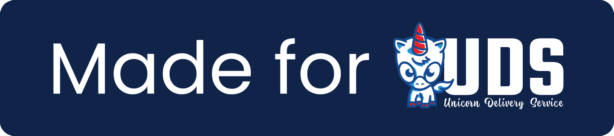

# 🏭 UDS Valkey Package

> [!WARNING]  
> `uds-package-valkey` is in early alpha and is not ready for general consumption.  It is currently only supported as a provider of Redis to [`uds-package-gitlab`](https://github.com/defenseunicorns/uds-package-gitlab)

This package is designed for use as part of a [UDS Software Factory](https://github.com/defenseunicorns/uds-software-factory) bundle deployed on [UDS Core](https://github.com/defenseunicorns/uds-core).

## Prerequisites

- [K3D](https://k3d.io/) for dev & test environments or any [CNCF Certified Kubernetes Cluster](https://www.cncf.io/training/certification/software-conformance/#logos) for production environments.

- [UDS CLI](https://github.com/defenseunicorns/uds-cli?tab=readme-ov-file#install) v0.9.2 or later

## Flavors

| Flavor | Description | Example Creation |
| ------ | ----------- | ---------------- |
| upstream | Uses upstream images within the package. | `uds zarf package create . -f upstream` |

Note: there is _not_ currently a registry1 flavor as Iron Bank does not have any `valkey` images yet.

## Releases

The released packages can be found in [ghcr](https://github.com/defenseunicorns/uds-package-valkey/pkgs/container/packages%2Fuds%valkey).

## UDS Tasks (for local dev and CI)

*For local dev, this requires installing [uds-cli](https://github.com/defenseunicorns/uds-cli?tab=readme-ov-file#install)

After installing uds-cli, for a list of available tasks that can be run in this repository execute the following command:

`uds run --list`

## Contributing

Please see the [CONTRIBUTING.md](./CONTRIBUTING.md)

## Development

When developing this package it is ideal to utilize the json schemas for UDS Bundles, Zarf Packages and Maru Tasks. This involves configuring your IDE to provide schema validation for the respective files used by each application. For guidance on how to set up this schema validation, please refer to the [guide](https://github.com/defenseunicorns/uds-common/blob/main/docs/development-ide-configuration.md) in uds-common.
